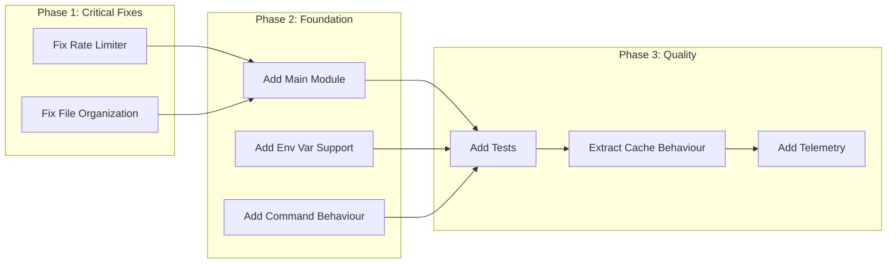

# Claude Discord Bot - Structural Improvement Plan

This document outlines the structural improvements to be made to the codebase, focusing on fixing architectural issues before adding new features.

## Overview



---

## Phase 1: Critical Fixes

### 1.1 Fix Rate Limiter Blocking Issue

**File:** `lib/claude/rate_limiter.ex`

**Problem:** `Process.sleep/1` inside `handle_call/3` blocks the GenServer, preventing other users from being served.

**Solution:** Return rate limit status immediately; move sleep to caller's process.

**Changes Required:**

1. **Modify `handle_call({:check_and_update, ...})`** to return without sleeping:
   ```elixir
   # Instead of sleeping and then returning {:ok, wait_time}
   # Return {:rate_limited, wait_time} immediately
   {:reply, {:rate_limited, wait_time}, state}
   ```

2. **Add new function `check_and_wait/1`** that handles the sleep in caller's process:
   ```elixir
   @spec check_and_wait(Nostrum.Snowflake.t()) :: :ok | {:error, term()}
   def check_and_wait(user_id) do
     case check(user_id) do
       {:ok, :allowed} -> 
         update(user_id)
         :ok
       {:ok, {:wait, ms}} -> 
         Process.sleep(ms)
         update(user_id)
         :ok
       error -> error
     end
   end
   ```

3. **Update `message_handler.ex`** to use new rate limiter API

**New Rate Limiter API:**
| Function | Returns | Description |
|----------|---------|-------------|
| `check/1` | `{:ok, :allowed}` or `{:ok, {:wait, ms}}` | Check without updating |
| `update/1` | `:ok` | Update timestamp after successful check |
| `check_and_wait/1` | `:ok` | Convenience function - check, sleep if needed, update |

---

### 1.2 Fix File Organization

**Problem:** `lib/consumers.ex` is outside the `claude/` namespace but defines `Claude.MessageConsumer`.

**Solution:** Move and rename file to match convention.

**Changes:**
1. Move `lib/consumers.ex` → `lib/claude/message_consumer.ex`
2. Update any imports if necessary (currently none)

---

## Phase 2: Foundation Improvements

### 2.1 Create Main Module

**File:** `lib/claude.ex` (new)

**Purpose:** Provides a public API entry point and documents the application.

**Content:**
```elixir
defmodule Claude do
  @moduledoc """
  Claude Discord Bot - An AI-powered Discord bot.
  
  ## Main Components
  
  - `Claude.Application` - OTP Application and supervision tree
  - `Claude.MessageHandler` - Processes incoming Discord messages
  - `Claude.LLM` - LLM provider facade
  - `Claude.Commands` - Slash command handlers
  
  ## Configuration
  
  See `Claude.Config` for all configuration options.
  """
  
  @doc "Returns the application version"
  @spec version() :: String.t()
  def version, do: Application.spec(:claude, :vsn) |> to_string()
  
  @doc "Returns bot status information"
  @spec status() :: map()
  def status do
    %{
      version: version(),
      bot_user_id: Claude.Config.bot_user_id(),
      provider: Claude.LLM.provider_name(),
      model: Claude.Config.model()
    }
  end
end
```

---

### 2.2 Add Environment Variable Support

**File:** `lib/claude/config.ex`

**Problem:** Configuration only works via config files; no env var support.

**Solution:** Check environment variables with fallback to config files.

**Changes to `get_config/2`:**
```elixir
defp get_config(key, default) do
  # First try environment variable (e.g., CLAUDE_MODEL, CLAUDE_LLM_API_KEY)
  env_key = "CLAUDE_#{key |> to_string() |> String.upcase()}"
  
  case System.get_env(env_key) do
    nil -> get_from_app_config(key, default)
    value -> parse_env_value(key, value)
  end
end

defp get_from_app_config(key, default) do
  case Application.get_env(:claude, :llm) do
    nil -> default
    llm_config when is_map(llm_config) -> Map.get(llm_config, key, default)
    _ -> default
  end
end

defp parse_env_value(key, value) when key in [:rate_limit_ms, :max_tokens, :max_context_messages] do
  String.to_integer(value)
end
defp parse_env_value(_key, value), do: value
```

**Supported Environment Variables:**
| Env Var | Config Key | Type |
|---------|------------|------|
| `CLAUDE_DISCORD_TOKEN` | `discord.token` | string |
| `CLAUDE_LLM_API_KEY` | `llm.llm_api_key` | string |
| `CLAUDE_LLM_BASE_URL` | `llm.llm_base_url` | string |
| `CLAUDE_MODEL` | `llm.model` | string |
| `CLAUDE_MAX_TOKENS` | `llm.max_tokens` | integer |
| `CLAUDE_RATE_LIMIT_MS` | `llm.rate_limit_ms` | integer |

---

### 2.3 Add Command Behaviour

**File:** `lib/claude/commands/command.ex` (new)

**Purpose:** Enforce consistent structure for all slash commands.

```elixir
defmodule Claude.Commands.Command do
  @moduledoc """
  Behaviour for slash command implementations.
  """
  
  @type command_definition :: %{
    name: String.t(),
    description: String.t(),
    type: integer(),
    options: list(map()) | nil
  }
  
  @doc "Returns the command definition for Discord registration"
  @callback definition() :: command_definition()
  
  @doc "Handles the command interaction"
  @callback handle(Nostrum.Struct.Interaction.t()) :: :ok | {:error, term()}
  
  @doc "Optional: Returns the command name"
  @callback name() :: String.t()
  
  @optional_callbacks [name: 0]
end
```

**Update existing commands** to use the behaviour:
- `lib/claude/commands/help.ex` - Add `@behaviour Claude.Commands.Command`
- `lib/claude/commands/info.ex` - Add `@behaviour Claude.Commands.Command`

---

## Phase 3: Quality Improvements

### 3.1 Add Comprehensive Tests

**Files to create:**
```
test/
├── claude_test.exs              # Main module tests
├── claude/
│   ├── config_test.exs          # Config tests
│   ├── rate_limiter_test.exs    # Rate limiter tests  
│   ├── message_handler_test.exs # Message handling tests
│   ├── llm_test.exs             # LLM facade tests
│   └── utils_test.exs           # Utility function tests
└── support/
    └── mocks.ex                 # Mock modules for testing
```

**Testing Strategy:**
1. Use `Mox` for mocking HTTP requests and Discord API
2. Add `test/support/mocks.ex` for defining mock behaviours
3. Test each module in isolation
4. Add integration tests for message flow

**Example test structure for rate limiter:**
```elixir
defmodule Claude.RateLimiterTest do
  use ExUnit.Case, async: true
  
  setup do
    {:ok, pid} = Claude.RateLimiter.start_link(name: :"test_#{:erlang.unique_integer()}")
    %{pid: pid}
  end
  
  describe "check/1" do
    test "allows first message from user" do
      assert {:ok, :allowed} = Claude.RateLimiter.check(123)
    end
    
    test "returns wait time for rapid messages" do
      Claude.RateLimiter.update(123)
      assert {:ok, {:wait, _ms}} = Claude.RateLimiter.check(123)
    end
  end
end
```

---

### 3.2 Extract Generic Cache Behaviour

**File:** `lib/claude/cache.ex` (new)

**Purpose:** DRY up the duplicate ETS cache logic.

```elixir
defmodule Claude.Cache do
  @moduledoc """
  Behaviour and helper functions for ETS-backed caches.
  """
  
  @callback table_name() :: atom()
  @callback fetch(key :: term()) :: {:ok, term()} | {:error, term()}
  
  defmacro __using__(opts) do
    table_name = Keyword.fetch!(opts, :table_name)
    
    quote do
      use GenServer
      require Logger
      
      @table_name unquote(table_name)
      
      def start_link(opts \\ []) do
        name = Keyword.get(opts, :name, __MODULE__)
        GenServer.start_link(__MODULE__, opts, name: name)
      end
      
      @impl true
      def init(_opts) do
        table = :ets.new(@table_name, [:set, :public, :named_table, read_concurrency: true])
        {:ok, %{table: table}}
      end
      
      def get(key) do
        case :ets.lookup(@table_name, key) do
          [{^key, value}] -> {:ok, value}
          [] -> fetch_and_cache(key)
        end
      end
      
      def put(key, value) do
        :ets.insert(@table_name, {key, value})
        :ok
      end
      
      def invalidate(key) do
        :ets.delete(@table_name, key)
        :ok
      end
      
      def clear do
        :ets.delete_all_objects(@table_name)
        :ok
      end
      
      # To be implemented by each cache
      def fetch_and_cache(_key), do: {:error, :not_implemented}
      
      defoverridable [fetch_and_cache: 1]
    end
  end
end
```

**Refactor UserCache:**
```elixir
defmodule Claude.UserCache do
  use Claude.Cache, table_name: :claude_user_cache
  
  @impl true
  def fetch_and_cache(user_id) do
    case Nostrum.Api.User.get(user_id) do
      {:ok, user} ->
        put(user_id, user)
        {:ok, user}
      error -> error
    end
  end
end
```

---

### 3.3 Add Telemetry

**File:** `lib/claude/telemetry.ex` (new)

**Purpose:** Add observability for monitoring and debugging.

**Events to emit:**
```elixir
# Message handling
[:claude, :message, :start]
[:claude, :message, :stop]
[:claude, :message, :exception]

# LLM requests
[:claude, :llm, :request, :start]
[:claude, :llm, :request, :stop]
[:claude, :llm, :request, :exception]

# Rate limiting
[:claude, :rate_limiter, :check]
[:claude, :rate_limiter, :limited]

# Cache operations
[:claude, :cache, :hit]
[:claude, :cache, :miss]
```

**Dependencies to add to mix.exs:**
```elixir
{:telemetry, "~> 1.2"},
{:telemetry_metrics, "~> 0.6"},
{:telemetry_poller, "~> 1.0"}
```

---

## Implementation Order

The recommended implementation order prioritizes fixes that have the most impact:

| # | Task | Priority | Estimated Effort |
|---|------|----------|------------------|
| 1 | Fix rate limiter blocking | Critical | 30 min |
| 2 | Move consumers.ex | Critical | 5 min |
| 3 | Create main module | Medium | 15 min |
| 4 | Add env var support | Medium | 30 min |
| 5 | Add command behaviour | Low | 20 min |
| 6 | Add rate limiter tests | Medium | 45 min |
| 7 | Add config tests | Medium | 30 min |
| 8 | Add utils tests | Medium | 45 min |
| 9 | Extract cache behaviour | Low | 45 min |
| 10 | Add telemetry | Low | 1 hour |

---

## Future Improvements (Phase 4+)

Once structural fixes are complete, consider these enhancements:

- **New LLM Providers:** Anthropic direct API, Ollama for local models
- **Image Generation:** `/image` command with fal.ai
- **Persistence:** Ecto + PostgreSQL for conversation history
- **Guild Config:** Per-server settings stored in database
- **Streaming:** Stream LLM responses for faster perceived response
- **Message Chunking:** Split responses >2000 chars automatically
- **Circuit Breaker:** Graceful degradation for API failures
- **Admin Commands:** `/stats`, `/config` for bot operators